 **Note:** The photos with red borders are the rebuild of the website. Photos with green borders are the original website. Photos with no border are the fix/improvement to the website.

**Home Page:** https://girlscouts.magis.marketing

The font family for the titles inside the container should be Overlock.

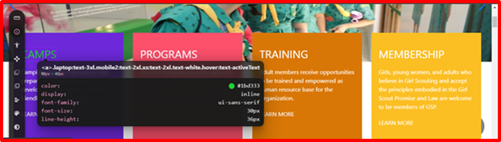
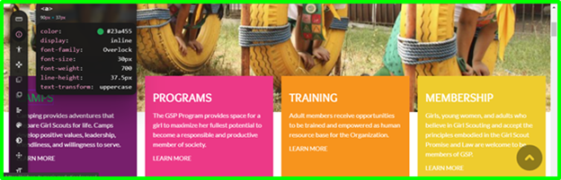

The font-family should be Lato.

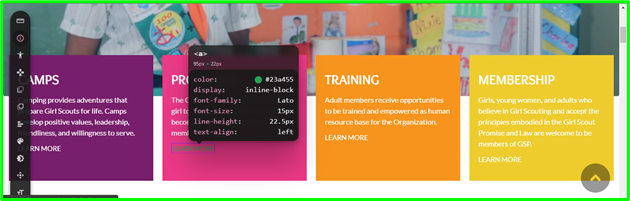

The bg color of the circle should be #009944 and the icon size inside should be 44px. The title should use Overlock for font-family and Lato for the description.

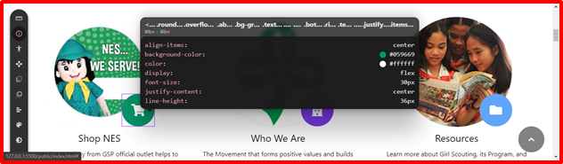
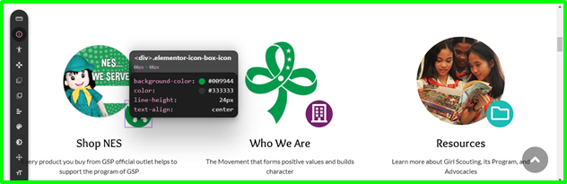

The bg color of the circle should be #771f6c and the icon size inside should be 44px.The title should use Overlock for font-family and Lato for the description.

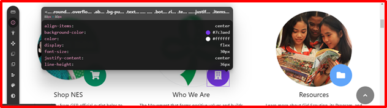

The bg color of the circle should be #1cbbb4 and the icon size inside should be 44px.The title should use Overlock for font-family and Lato for the description.

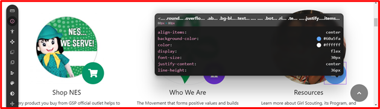
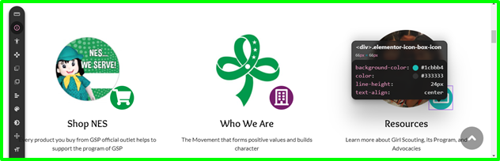

The bg color of the circle should be #f7841d and the icon size inside should be 44px.The title should use Overlock for font-family and Lato for the description.

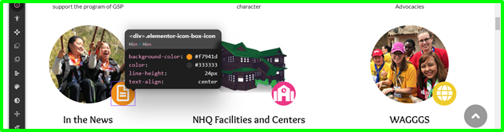

The bg color of the circle should be #ec3987 and the icon size inside should be 44px.The title should use Overlock for font-family and Lato for the description.

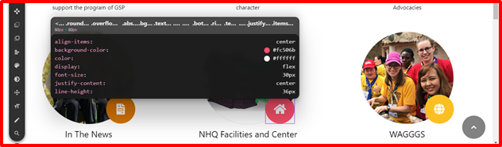
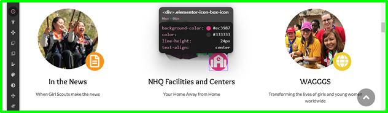

The bg color of the circle should be #eecc2e and the icon size inside should be 44px.The title should use Overlock for font-family and Lato for the description.

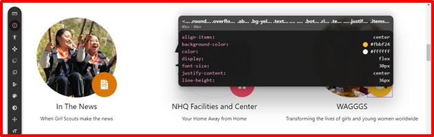
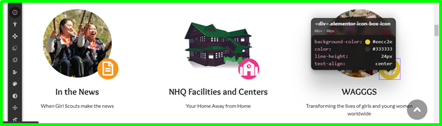

The family-font for “Girl Scouts by the Numbers:” shout be Overlock.

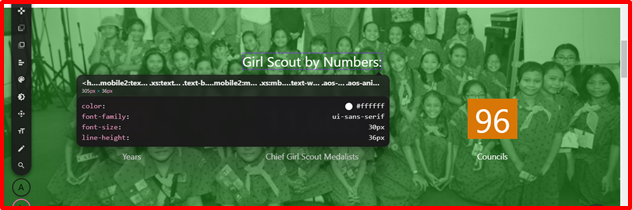

The font-family for the number description should be Lato with the font-size of 20px.

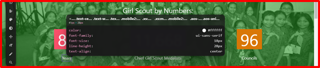
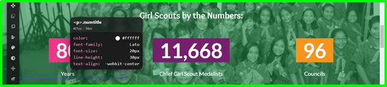

Day font-size should be 29px.

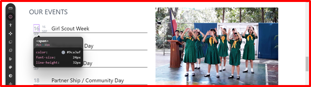
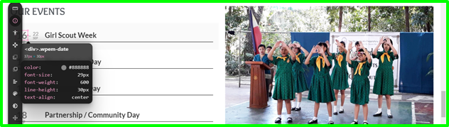

Month font-size should be 13px.

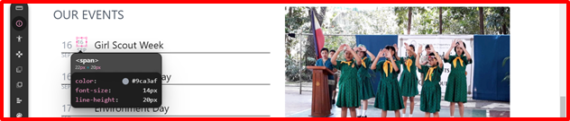

The font-size of the day should be 15px and the date must be 22 not 16.

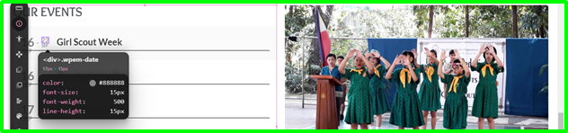

The font-size of the month below should be 9px.

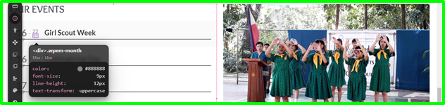

The button color should be #61ce70 with Lato as the font-family and 15px as the font-size.

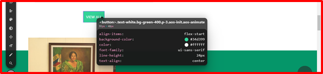
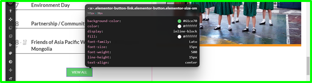

There’s no color mustard line beneath the image. 

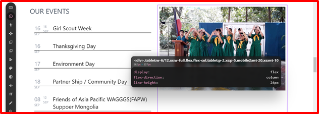
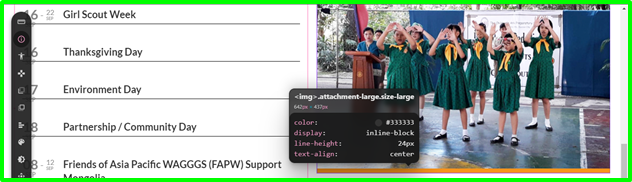

“My Girl Scout Journey” should be 32px with Overlock as the font-family.

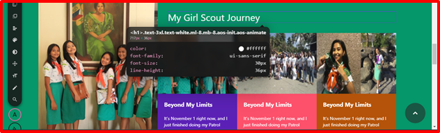
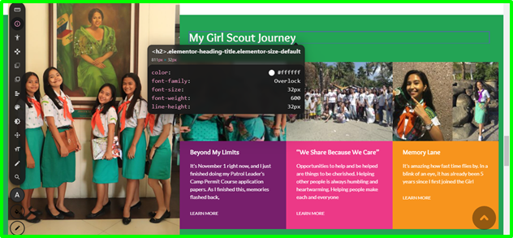

The font-family for the title in each box should be Overlock with 18px font-size. The 2nd box title should be “We Share Because We Care” with the bg color of #ec3987, 3rd box title should be “Memory Lane” with bg color of #f7941d, and the 1st box should have a bg color of #771f6c. The font-family for the descriptions should be Lato. The link “Learn More” should be 12px in font-size.

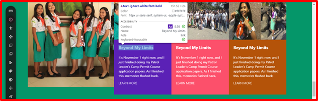
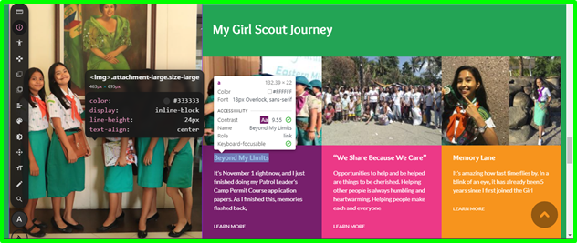

Font-size should be 32px with Overlock as the font-family.

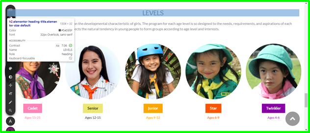

The Front-family should be Lato.

The thumbnail size should be 251.29px x 251.29px.

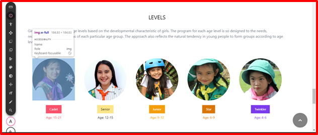
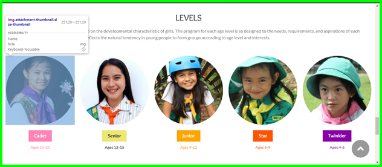

The font-size of the Cadet button should be 18px, font-family:Overlock with the bg color of #ff38b7. The padding should be 10px for vertical and 20px horizontal. The font-family of age range below should be Lato with font-size of 14px and a font-color of #ff38b7.

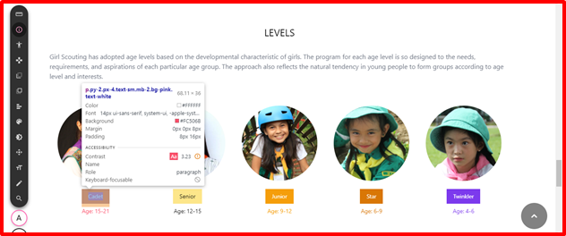

The font-size of the Senior button should be 18px, font-family:Overlock with the bg color of #ece675. The padding should be 10px for vertical and 20px horizontal. The font-family of age range below should be Lato with font-size of 14px and a font-color of #000000.

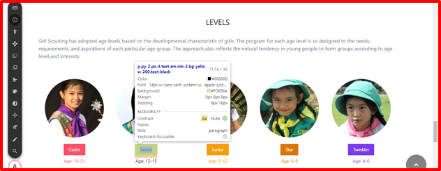
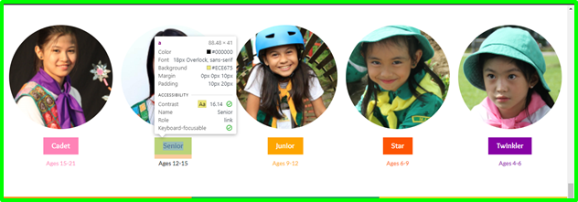

The font-size of the Junior button should be 18px, font-family:Overlock with the bg color of #fda500. The padding should be 10px for vertical and 20px horizontal. The font-family of age range below should be Lato with font-size of 14px and a font-color of #fda500

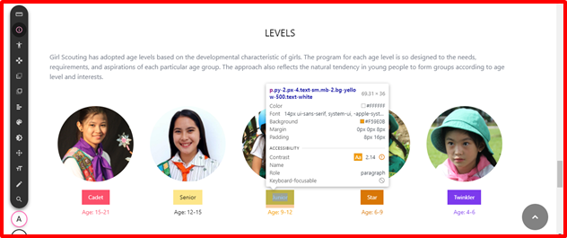
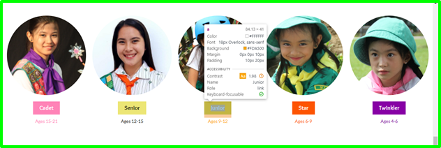

The font-size of the Star button should be 18px, font-family:Overlock with the bg color of #fd5403. The padding should be 10px for vertical and 20px horizontal. The font-family of age range below should be Lato with font-size of 14px and a font-color of #fd5403.

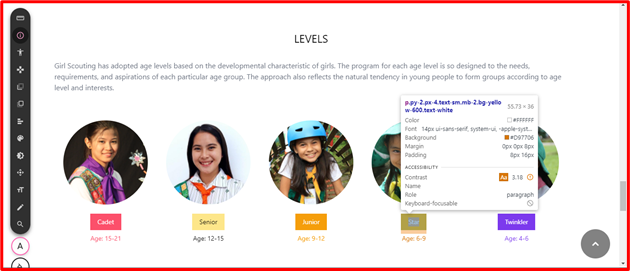
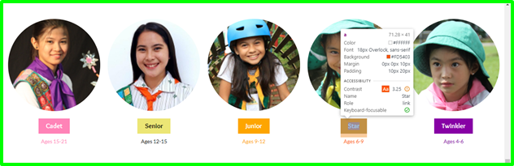

The font-size of the Twinkler button should be 18px, font-family:Overlock with the bg color of #8701a5. The padding should be 10px for vertical and 20px horizontal. The font-family of age range below should be Lato with font-size of 14px and a font-color of #8701a5.

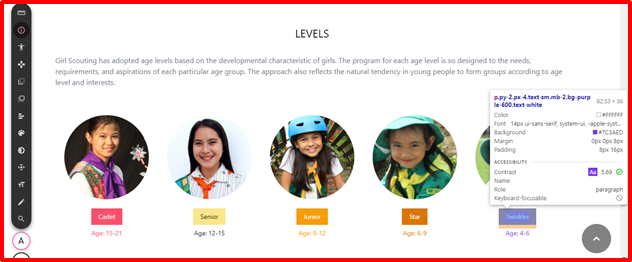
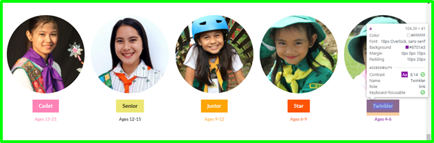

Icon bg color should be #23A455

**Post View Page:** https://girlscouts.magis.marketing/camps/girl-scouting-around-the-world-my-experience-at-the-17th-intl-camp-korea/

Title family-font should be Overlock.

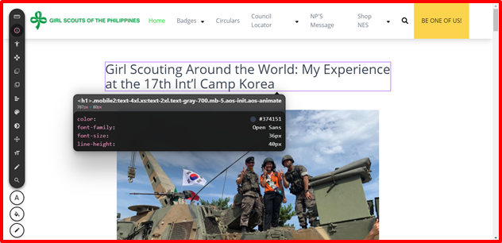
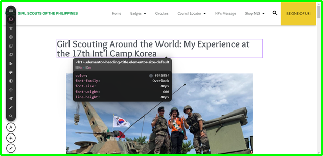

**Publications Page:** https://girlscouts.magis.marketing/publications/

It should be “BE ONE OF US” with Overlock as the font-family and 23px fot the font-size.

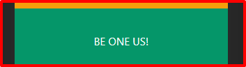

